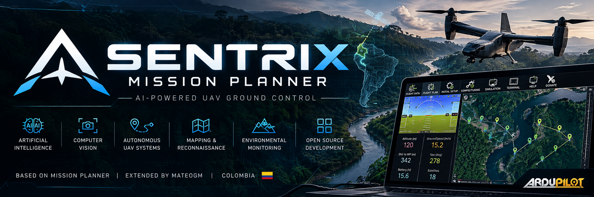

# SENTRIX Mission Planner

> **SENTRIX Mission Planner is an ongoing student project that aims to advance open-source ground control software for UAVs through AI-powered autonomy and intelligent systems. Based on Mission Planner and extended through subsequent development by MateoGM, Colombia, the project focuses on research, learning, experimentation, and the development of new AI capabilities for UAVs. Spanish language support is also planned across the complete application, including the original Mission Planner components and all subsequent SENTRIX developments.**

---

## About SENTRIX

SENTRIX Mission Planner is an open-source student project focused on the evolution of UAV ground-control software through artificial intelligence, intelligent systems, and autonomous capabilities.

The project is based on Mission Planner and progressively extends it through original research, software development, AI experimentation, UAV data analysis, perception, autonomy, and future intelligent-control capabilities.

SENTRIX is developed as a learning, research, and experimentation platform. New functionality will be introduced progressively as the project architecture and software engineering practices mature.

### Project Status

- **Status:** In development
- **Type:** Student / research project
- **Platform:** UAV Ground Control Station
- **Original development:** Mission Planner
- **Subsequent development:** MateoGM — Colombia

As a student beginning my journey in programming and artificial intelligence, contributions, suggestions, bug reports, and improvements to the new SENTRIX code are welcome and can help the project grow.

## AI and UAV Direction

The long-term technical direction includes:

- AI-assisted UAV operations.
- Computer vision and perception.
- Machine learning and deep learning.
- Telemetry and vehicle-data analysis.
- Intelligent mission planning.
- Autonomous decision support.
- Integration of AI capabilities with UAV systems.
- Development of intelligent systems for autonomous UAV operations.
- Future research into advanced perception, decision-making, and autonomy.

## Spanish Language Support

Spanish support is planned across the complete application, including the original Mission Planner interface and all new SENTRIX-developed components.

The objective is to progressively provide a consistent Spanish-language experience while preserving the original functionality, attribution, and licensing of inherited components.

## Development Philosophy

SENTRIX is developed progressively with emphasis on:

- Understanding the existing architecture.
- Learning software engineering through practical development.
- Maintaining traceability between inherited and original code.
- Reliable software engineering and testing.
- AI and UAV experimentation.
- Documentation and reproducibility.
- Incremental development and validation.
- Open-source collaboration and knowledge sharing.

---

## Credits

SENTRIX Mission Planner is based on the **Mission Planner** project developed by **ArduPilot and its contributors**.

SENTRIX preserves the original authorship, copyright notices, attribution, and applicable licenses of Mission Planner and other third-party components.

### Subsequent SENTRIX Development

**MateoGM — Colombia**

New original code, modifications, AI components, research, integrations, and other contributions developed specifically for SENTRIX will be documented as the project evolves.

SENTRIX Mission Planner is an independent project and is **not the official Mission Planner project or an official ArduPilot product**.

---

## Licensing

This repository contains software originating from Mission Planner and other third-party projects. Their respective licenses, copyright notices, and attribution requirements remain applicable to the corresponding components.

This repository currently includes:

- `COPYING.txt` — GNU General Public License v3.
- `LICENSE.txt` — GNU Affero General Public License v3.
- Additional third-party components may have their own licenses.

The presence of a license file in the repository does not replace or override the license applicable to third-party or inherited code.

Original and third-party components retain their respective copyright notices, licenses, and applicable conditions.

---

## Open Source

SENTRIX is being developed as an open-source project.

The objective is to make the new SENTRIX development available for study, experimentation, collaboration, and further improvement, while respecting the licenses and attribution requirements of the inherited Mission Planner and third-party components.

Contributions to the new SENTRIX code are welcome, including:

- Bug reports.
- Code improvements.
- Documentation.
- Translations.
- Testing.
- AI experimentation.
- UAV-related research.
- Software architecture suggestions.
- New features and integrations.

---

## Development

SENTRIX is developed progressively with emphasis on:

- Understanding the existing architecture.
- Maintaining traceability between inherited and subsequent code.
- Reliable software engineering and testing.
- AI and UAV experimentation.
- Documentation and reproducibility.
- Incremental development and validation.

---

## Original Project

### Mission Planner

Developed by **ArduPilot and its contributors**.

Official project:

https://github.com/ArduPilot/MissionPlanner

SENTRIX retains the applicable attribution and licensing information associated with the inherited Mission Planner codebase.

---

## Project Notice

SENTRIX Mission Planner is an independent student and research project intended for software development, education, research, simulation, and controlled experimentation.

It should not be represented as the official Mission Planner project or as an official ArduPilot product.

SENTRIX Mission Planner is developed independently by MateoGM and is intended to document the learning and development process involved in building new AI and UAV capabilities.

---

## CA Certificate

A CA cert is installed to the root store and used to sign the windows serial port drivers, and is installed as part of the MSI install.

---

# SENTRIX Mission Planner — Español

## Acerca de SENTRIX

SENTRIX Mission Planner es un proyecto estudiantil de código abierto enfocado en la evolución del software de control terrestre para UAV mediante inteligencia artificial, sistemas inteligentes y capacidades autónomas.

El proyecto se basa en Mission Planner y lo amplía progresivamente mediante investigación original, desarrollo de software, experimentación con IA, análisis de datos UAV, percepción, autonomía y futuras capacidades de control inteligente.

SENTRIX se desarrolla como una plataforma de aprendizaje, investigación y experimentación. Las nuevas funciones se incorporarán progresivamente a medida que evolucionen la arquitectura y las prácticas de ingeniería de software.

### Estado del proyecto

- **Estado:** En desarrollo
- **Tipo:** Proyecto estudiantil / investigación
- **Plataforma:** Estación de control terrestre para UAV
- **Desarrollo original:** Mission Planner
- **Desarrollo posterior:** MateoGM — Colombia

Como estudiante que está iniciando su formación en programación e inteligencia artificial, son bienvenidos los aportes, sugerencias, reportes de errores y mejoras al nuevo código de SENTRIX, ya que pueden ayudar al crecimiento del proyecto.

## Dirección de IA y UAV

La dirección tecnológica a largo plazo incluye:

- Asistencia mediante IA para operaciones UAV.
- Visión artificial y percepción.
- Machine learning y deep learning.
- Telemetría y análisis de datos de vuelo.
- Planificación inteligente de misiones.
- Soporte para toma de decisiones autónomas.
- Integración de capacidades de IA con sistemas UAV.
- Desarrollo de sistemas inteligentes para operaciones UAV autónomas.
- Investigación futura en percepción avanzada, toma de decisiones y autonomía.

## Soporte del idioma español

Se plantea incorporar soporte en español en toda la aplicación, incluyendo la interfaz original de Mission Planner y todos los componentes desarrollados posteriormente para SENTRIX.

El objetivo es proporcionar progresivamente una experiencia coherente en español, preservando la funcionalidad, autoría y licencias de los componentes heredados.

## Filosofía de desarrollo

SENTRIX se desarrolla progresivamente con énfasis en:

- Comprensión de la arquitectura existente.
- Aprendizaje de ingeniería de software mediante desarrollo práctico.
- Trazabilidad entre código heredado y código desarrollado posteriormente.
- Ingeniería de software y pruebas.
- Experimentación con IA y UAV.
- Documentación y reproducibilidad.
- Desarrollo y validación incremental.
- Colaboración y difusión del conocimiento mediante código abierto.

---

## Créditos

SENTRIX Mission Planner se basa en el proyecto **Mission Planner**, desarrollado por **ArduPilot y sus colaboradores**.

SENTRIX conserva la autoría original, los avisos de copyright, las atribuciones y las licencias aplicables de Mission Planner y de los demás componentes de terceros.

### Desarrollo posterior de SENTRIX

**MateoGM — Colombia**

El código nuevo, modificaciones, componentes de IA, investigaciones, integraciones y demás desarrollos realizados específicamente para SENTRIX serán documentados a medida que evolucione el proyecto.

SENTRIX Mission Planner es un proyecto independiente y **no es el proyecto oficial de Mission Planner ni un producto oficial de ArduPilot**.

---

## Código Abierto

SENTRIX se desarrolla como un proyecto de código abierto.

El objetivo es mantener disponible el nuevo desarrollo de SENTRIX para estudio, experimentación, colaboración y mejora continua, respetando al mismo tiempo las licencias y requisitos de atribución de Mission Planner y de los componentes de terceros heredados.

Son bienvenidos los aportes al nuevo código de SENTRIX, incluyendo:

- Reportes de errores.
- Mejoras de código.
- Documentación.
- Traducciones.
- Pruebas.
- Experimentación con IA.
- Investigación relacionada con UAV.
- Sugerencias de arquitectura de software.
- Nuevas funciones e integraciones.

---

## Desarrollo

SENTRIX se desarrolla progresivamente con énfasis en:

- Comprensión de la arquitectura existente.
- Trazabilidad entre código heredado y código desarrollado posteriormente.
- Ingeniería de software y pruebas.
- Experimentación con IA y UAV.
- Documentación y reproducibilidad.
- Desarrollo y validación incremental.

---

## Proyecto Original

### Mission Planner

Desarrollado por **ArduPilot y sus colaboradores**.

Proyecto oficial:

https://github.com/ArduPilot/MissionPlanner

SENTRIX conserva la información de atribución y las licencias aplicables asociadas al código heredado de Mission Planner.

---

## Aviso del Proyecto

SENTRIX Mission Planner es un proyecto estudiantil y de investigación independiente destinado al desarrollo de software, educación, investigación, simulación y experimentación controlada.

No debe presentarse como el proyecto oficial de Mission Planner ni como un producto oficial de ArduPilot.

SENTRIX Mission Planner es desarrollado independientemente por MateoGM y tiene como objetivo documentar el proceso de aprendizaje y desarrollo involucrado en la construcción de nuevas capacidades de IA y UAV.

---

## Licencias

Este repositorio contiene software proveniente de Mission Planner y de otros proyectos de terceros. Sus respectivas licencias, avisos de copyright y requisitos de atribución continúan siendo aplicables a los componentes correspondientes.

Actualmente este repositorio incluye:

- `COPYING.txt` — GNU General Public License v3.
- `LICENSE.txt` — GNU Affero General Public License v3.
- Otros componentes de terceros pueden tener sus propias licencias.

La presencia de un archivo de licencia en el repositorio no reemplaza ni anula la licencia aplicable al código de terceros o al código heredado.

Los componentes originales y de terceros conservarán sus respectivos avisos de autoría, licencias y condiciones aplicables.

---

## Certificado CA

El proyecto original de Mission Planner incluye un certificado CA instalado en el almacén raíz y utilizado para firmar los controladores de puerto serie de Windows, como parte de la instalación MSI.

---

**SENTRIX Mission Planner**  
**Open Source · Student Project · AI · UAV · Autonomous Systems**

**MateoGM — Colombia**
